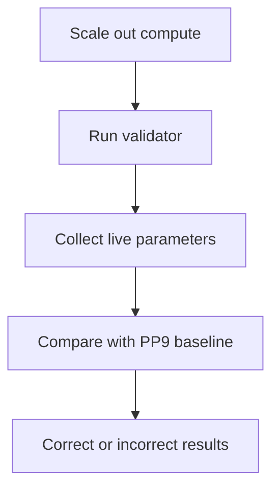

# OpenStack PP9 Compute Parameter Validator

A post–scale-out health-check automation for performance-sensitive OpenStack
compute nodes. It compares live host configuration against the required PP9
baseline and reports each setting as correct or incorrect.

> This public portfolio edition preserves the original validation sequence,
> commands, comparisons, messages, and control flow. Exact production versions,
> CPU masks, PCI addresses, tuning values, and counts are replaced by explicit
> placeholders. The unredacted original is retained privately.

## Operational problem

Newly scaled-out compute nodes initially inherited default parameters. Before
VMs or workloads could be moved safely to a new node, engineers had to verify
that platform, CPU-pinning, fast-path, networking, and security settings matched
the infrastructure-specific baseline.

The former process required engineers to collect several command outputs and
compare long values manually. CPU ranges, masks, versions, PCI identifiers, and
large option strings were particularly easy to misread. A single missed number
could leave a configuration error undetected and later affect workload placement
or VM operation.

## Solution

The script executes the complete validation sequence and turns each manual
comparison into a clear result such as `Correct CPU set` or
`Incorrect Fast Path parameters`. This provides one repeatable post–scale-out
check instead of multiple error-prone comparisons.

## Validation coverage

| # | Check | Operational purpose |
|---:|---|---|
| 1 | Nuage version | Confirms the required platform build |
| 2 | CPUSET_ENABLE | Confirms CPU-set isolation is enabled |
| 3 | Open vSwitch version | Confirms the expected OVS build |
| 4 | System CPU affinity | Checks reserved system CPUs |
| 5 | Nova `vcpu_pin_set` | Checks VM workload CPU allocation |
| 6 | `ovs-vswitchd` task affinity | Checks OVS process CPU placement |
| 7 | Fast-path environment | Compares the complete tuning baseline |
| 8 | DPVI poll processes | Confirms the expected poll-process count |
| 9 | OVS connectivity | Checks that the virtual switch is connected |
| 10 | Bridge MTU | Confirms the required network MTU |
| 11 | SELinux mode | Confirms the expected enforcement mode |

## Workflow



## Repository contents

| Path | Purpose |
|---|---|
| `pp9_compute_health_check.sh` | Public-redacted copy of the original script |
| `sample-output/pp9-health-check.synthetic.txt` | Non-production demonstration |
| `docs/validation-reference.md` | Explanation of every result message |
| `.github/workflows/validate.yml` | Redaction validation |

The public copy intentionally requires users to replace angle-bracketed
placeholders with values approved for their own environment.

## Usage

The validator requires access to the target compute node and the same platform
commands and configuration files used by the original environment.

```bash
cp pp9_compute_health_check.sh pp9_compute_health_check.local.sh
# Replace every <PLACEHOLDER> in the local copy with an approved site value.
chmod +x pp9_compute_health_check.local.sh
sudo ./pp9_compute_health_check.local.sh
```

The script is an observational validator: it reports mismatches but does not
change the compute-node configuration.

## Synthetic output

```text
Nuage version is correct
CPUSET enabled
Correct Ovs Version
Correct CPU Affinity
Correct CPU set
Correct affinity list
Correct Fast Path parameters
Correct DPVI polls
Response is true
Correct MTU
getenforce Permissive
```

This output is illustrative only. No production command output is included.

## Impact

- Replaced a lengthy line-by-line manual comparison with one repeatable check.
- Reduced the risk of missing a digit, CPU range, mask, version, or option.
- Identified incorrect defaults before VM or workload placement.
- Standardized post–scale-out validation across compute nodes.
- Produced direct pass/fail-style messages for faster troubleshooting.

## Technologies

Bash, Linux, OpenStack Nova, Open vSwitch, Nuage/6WIND fast path, CPU pinning,
DPVI, systemd, SELinux

## Testing limitations

The original script reads absolute system paths and live platform commands.
Changing these dependencies to accept mock input would change its logic, so the
public workflow verifies that required redaction placeholders remain present.
The included synthetic transcript demonstrates reporting without claiming a
live infrastructure test.

## Confidentiality

The public edition excludes exact infrastructure-specific software versions,
CPU masks, PCI addresses, fast-path tuning values, MTU, and process counts. It
contains no production output, credentials, hostnames, or customer data.

## License

[MIT](LICENSE)
